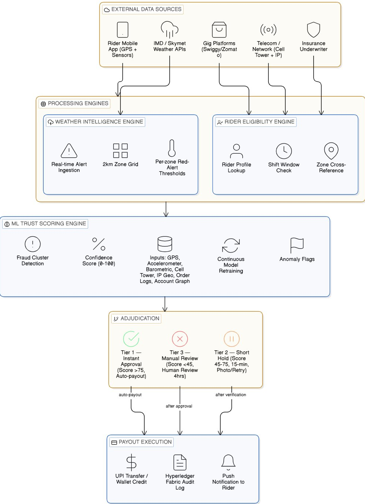

# Kavach
**Financial protection for gig delivery workers in India**
Team: GuideX | DEV Trails 2026

---

## The Problem

There are over 15 million delivery workers in India. They ride for Swiggy, Zomato, Dunzo, and a dozen other platforms. Every one of them earns per delivery. No delivery, no money. That is the whole equation.

When a red alert hits Chennai or Mumbai floods, the platform goes silent. Orders stop. A rider who was going to make Rs. 800 that day makes zero. Sometimes for two days. Sometimes three. There is no weather leave. No paid downtime. Nothing built into the system for this.

Most of these workers are running on weekly cash with nothing saved. One bad week is not an inconvenience. It is a genuine crisis. Borrowed money, missed rent, a conversation with a landlord they did not want to have.

The insurance products that exist today do not solve this. They ask workers to file a claim, upload documents, wait for an adjuster, and follow up. Even when everything works, the money comes days later. The financial hit lands immediately. The relief does not. That gap is what Kavach is built to close.

---

## Who We Built This For

**Rajan. 27. Delivery rider. Chennai.**

Two years on Zomato. Makes around Rs. 750 on a good day. Every northeast monsoon he loses four to six working days. Last year he borrowed Rs. 3,000 from a neighbour to cover rent during a three-day red alert. Took him six weeks to pay it back.

Rajan does not need a policy with fine print and a claims portal. He needs money in his account before he has to ask someone else for it.

That is the only problem statement Kavach was built around.

---

## What Kavach Does

Kavach is a parametric payout system. When a verified severe weather event is declared in a rider's operating zone, money moves to their account automatically. No claim. No form. No call centre. No waiting.

The payout is not triggered by what the worker reports. It fires based on external, verifiable conditions. When IMD issues a red alert for a zone and a registered rider's last confirmed location falls within that zone during an active shift window, the transfer initiates. Target time: under 15 minutes from alert confirmation.

The rider gets a notification. The money is there. That is the full user experience on their end.

---

## System Architecture



The system runs across three layers that operate in sequence every time a weather event is detected. External data feeds into the top, flows through eligibility and trust scoring in the middle, and exits as a verified payout at the bottom.

---

## Step-by-Step: How a Payout Happens

This is the full journey from a storm forming over Chennai to Rajan receiving money in his account.

**Step 1 — Weather event detected**

IMD issues a red alert for a coastal zone in Chennai. Kavach's weather intelligence engine picks this up within seconds via the IMD API feed, cross-checks it against Skymet data and the municipal disaster management authority feed, and marks the affected 2km grid zones as active. A monsoon alert in coastal Chennai has a lower threshold than one inland. The calibration is zone-specific, built from 10 years of historical weather data.

**Step 2 — Zone grid activated**

The affected zones flip to red-alert status in the system. This triggers the eligibility engine to begin querying registered riders whose last confirmed location falls within those zones.

**Step 3 — Rider eligibility check**

For each rider in the zone, the engine verifies three things: their platform partnership is active, their shift window overlaps with the alert window, and their account has no existing open disputes or fraud flags. This runs across all riders in parallel and completes in under 60 seconds.

**Step 4 — Device signals collected**

The Kavach app running on the rider's phone begins sending a signal bundle to the trust scoring engine. This includes GPS coordinates and trajectory history, accelerometer and gyroscope readings, barometric pressure from the device sensor, the device's registered cell tower, and the network IP origin of the request. Simultaneously, the system pulls the rider's real-time order log from the partner platform API.

**Step 5 — Trust score calculated**

The ML model takes all incoming signals and produces a confidence score between 0 and 100. A genuine stranded rider will show a GPS trace that entered the zone naturally, motion sensor data consistent with being on a vehicle or standing on a road, and a pressure reading that matches the storm. A fraudster at home produces a flat accelerometer, stable indoor pressure, and a coordinate jump with no trajectory. The score reflects how well the full signal profile matches the expected pattern of a real stranded worker.

The model also checks for coordinated fraud patterns. If 40-plus claims are arriving from overlapping coordinates within 10 minutes, a cluster flag fires regardless of individual scores.

**Step 6 — Three-tier decision**

Based on the confidence score, the claim goes one of three ways:

Score above 75: payout releases immediately, no action from the rider.

Score between 45 and 75: claim is held for up to 15 minutes. The rider gets a message asking them to either send a quick photo or wait while the system retries. If sensors stabilise as connectivity improves, it auto-approves. No accusation, just a verification step.

Score below 45 or hard fraud signals: payout is paused. The rider is notified and given 24 hours to submit supporting information. A human reviewer adjudicates within 4 hours of receiving that.

**Step 7 — Payout execution**

For approved claims, an automatic UPI transfer or wallet credit goes out to the rider. The transaction, the trigger event, the signals that produced the score, and the decision tier are all written to the Hyperledger Fabric ledger. The platform partner, the underwriter, and the regulator each have read access to this audit trail. Nothing is hidden from anyone who has a stake in the system.

**Step 8 — Rider notification**

The rider gets a push notification with the payout amount, the reason it was triggered, and a one-tap acknowledgement. That is the entire interaction from their end. If their claim was held or paused, they get a clear message explaining why and what they can do next.

**Step 9 — Model feedback loop**

Every resolved claim feeds back into the scoring model. Confirmed false positives (honest workers who were flagged) reduce the sensitivity of the signals that caused the flag. Confirmed fraud cases reinforce the patterns the model already detected. Over time the system becomes more accurate in both directions: catching more fraud and creating less friction for honest workers.

---

## How It Works (Technical Summary)

**Weather Intelligence**
We pull real-time alerts from IMD, Skymet, and municipal disaster management authority feeds. Each city is broken into a 2km x 2km zone grid, with red-alert thresholds calibrated per zone using 10 years of historical weather data. A monsoon alert in coastal Chennai has a different threshold than one in central Delhi. The system accounts for that.

**Rider Eligibility Engine**
Every registered rider has a profile: their platform partner, their usual operating zones, their recent shift activity. When a zone goes red, the engine runs through all riders active in that zone during the alert window and checks payout eligibility. This happens in under 60 seconds.

**Payout Execution**
Eligible riders get an automatic UPI transfer or wallet credit. Every transaction is logged on a permissioned blockchain (Hyperledger Fabric) so the platform partner, the underwriter, and the regulator all have a clean, immutable audit trail. What triggered the payout, which riders received it, and when. All of it verifiable.

---

## Business Model

Kavach is B2B. Gig platforms pay a per-rider monthly premium, target range Rs. 80 to 120 per rider, to offer Kavach as a built-in worker benefit. The actual risk is underwritten by licensed insurance partners who price each zone using our historical weather and claims data.

Riders pay nothing.

For a platform running 50,000 active riders, that is roughly Rs. 50 to 60 lakhs a month. What they get back: measurably lower rider churn during monsoon season, a worker welfare commitment they can actually point to with numbers, and a real answer when regulators ask what they are doing for their workforce.

---

## How It Works for Users

There are three types of users on Kavach. Each has a completely different experience.

### The Delivery Rider

Rajan does not interact with Kavach the way he interacts with most apps. He does not open it, file anything, or press a button when it rains. The app runs quietly in the background during his shift, the same way Google Maps does.

When a red alert is declared in his zone, here is what happens from his side:

He is out on his scooter or sheltering nearby waiting for the rain to ease. His phone buzzes. The notification reads: "Severe weather detected in your area. Your Kavach protection has been triggered. Rs. 400 will be credited to your account within 15 minutes."

He taps it. A screen shows the payout amount, the weather event that triggered it, and a single confirm button. He taps confirm. The money hits his UPI account.

That is the entire interaction. No form. No upload. No call. The hardest part of his day just got one thing easier.

If his claim is held for verification, the message is: "We are having trouble confirming your location because of network conditions. Send a quick photo of where you are or wait a few minutes while we retry." No accusation in the language. No threat to his account. Just a request for help that he can act on in ten seconds.

### The Gig Platform (Swiggy, Zomato, etc.)

The platform's operations team sets up Kavach once through a dashboard integration. They define which of their riders are enrolled, set the payout tier they want to offer, and connect their order log API so Kavach can cross-reference active orders during a weather event.

After that, they do nothing. When a red alert hits Mumbai, Kavach handles eligibility, verification, and payout automatically. The platform gets a dashboard notification that an event was triggered, how many riders were paid out, the total disbursed, and the audit log entry on the blockchain.

At the end of the month, they get one consolidated invoice. Their riders got paid. They did not have to build anything.

### The Insurance Underwriter

The underwriter prices risk per zone per season using the historical weather and claims data Kavach provides. They set the payout amount per event tier and the maximum exposure per alert.

During an event, they have read access to the Hyperledger Fabric ledger in real time. Every payout, every signal bundle that produced the decision, every fraud flag — all of it is visible as it happens. After the event they get a full actuarial report. No black box. No dispute over what was paid and why.

---

## Tech Stack

| Layer | Technology | Why |
|---|---|---|
| Mobile App | React Native | Single codebase for Android and iOS. Most riders are on Android but we are not cutting out iOS. |
| Backend API | Node.js + Express | Fast event-driven processing. Good ecosystem for integrating IMD, Skymet, UPI, and platform APIs. |
| Primary Database | PostgreSQL + PostGIS | Structured rider and transaction data. PostGIS handles the geospatial zone grid. |
| Cache Layer | Redis | Stores active zone states and session data so the eligibility engine does not hammer the database during a mass alert. |
| ML Scoring | Python + scikit-learn | Fraud scoring model runs as a standalone microservice. Can be retrained without touching the rest of the system. |
| Blockchain | Hyperledger Fabric | Permissioned network. Immutable audit trail for every payout decision. Three node types: Kavach, underwriter, regulator. |
| Weather Data | IMD API + Skymet | IMD as primary source, Skymet as cross-check. Municipal feeds added city by city. |
| Payments | UPI via Razorpay or PayU | Wallet credit as fallback for riders without a UPI-linked account. |
| Event Queue | AWS SQS | Handles mass alert triggers without dropping requests when thousands of riders are evaluated at once. |
| Infrastructure | AWS (EC2, RDS, ElastiCache) | Standard cloud setup. Scales horizontally during peak alert events. |

---

## Adversarial Defense & Anti-Spoofing Strategy

During our simulated alpha environment review, a syndicate of 500 delivery workers successfully attacked a beta parametric platform. They used GPS-spoofing apps to fake their locations into a red-alert zone while sitting at home, triggering mass false payouts and draining the liquidity pool.

This is not a fringe scenario. It is the most obvious attack vector against any parametric system that relies on GPS as its primary trust signal. We built Kavach's verification layer with this attack already in mind.

### The Core Principle

GPS is one input. Not ground truth. A payout is released only when multiple independent signals agree. Spoofing a GPS coordinate is one app download. Simultaneously faking GPS, cell tower association, device motion sensors, barometric pressure, and live platform order data from a living room couch is a fundamentally different problem. Not one a Telegram-organised syndicate is equipped to solve.

### Genuine Rider vs. Bad Actor

A real delivery worker stuck in a flood zone and someone at home faking that location leave completely different device signatures across five areas:

**Movement trajectory**
A genuine rider has a GPS trace showing actual travel into the zone before the alert. Roads, stops, delivery-pattern movement. A spoofed location just appears in the zone with no history behind it. Kavach flags any claim where the device shows no verifiable movement trail into the claimed zone in the 90 minutes before the alert fired.

**Device motion data**
A scooter on a road produces continuous accelerometer and gyroscope data: vibration, braking, turns. A phone sitting on a table at home produces a flat line. If a device is claiming to be out in a storm but its motion sensors show nothing, that is not a soft flag. That is a hard one.

**Barometric pressure**
Every modern smartphone has a barometric sensor. A genuine storm zone shows a measurable pressure drop consistent with what weather APIs report for that area. A phone sitting indoors a few kilometres away shows stable indoor pressure. That mismatch is physically difficult to fake without hardware most fraudsters will not have.

**Historical work geography**
Riders have years of delivery history. Someone who has never worked within 15km of a claimed zone suddenly appearing there during a red alert is worth a second look. Real workers almost always claim from areas where they actually ride.

**Platform activity conflict**
A stranded worker cannot have an open delivery order at the same time. If they do, the claim is rejected automatically. This one check alone would have caught the majority of the syndicate attack that drained the alpha platform.

### Fraud Detection Data Points

Beyond the five dimensions above, the risk engine also cross-references:

- **Cell tower triangulation.** The device's registered tower must be geographically consistent with the GPS claim. You cannot fake proximity to a cell tower without physically being near one.
- **IP geolocation.** The network origin of the app request is checked against the claimed zone. A home broadband IP claiming a flood zone gets flagged immediately.
- **Claim velocity monitoring.** More than 40 claims from overlapping GPS coordinates within a 10-minute window triggers a coordinated fraud alert. Real weather stranding produces geographically spread claims. Five hundred people clustered in the same 1km radius at the same moment is not how stranding works.
- **Account clustering.** Accounts that share sign-up IPs, device identifiers, or referral chains are grouped in a graph database. Simultaneous claims from the same cluster get higher scrutiny regardless of individual scores.
- **Order log verification.** With pre-authorised API access from our platform partners, we pull each claimant's real-time order history. This is the most direct fraud signal we have access to.

### Handling Flagged Claims Without Penalising Honest Workers

This is where most fraud systems get it wrong. Heavy rain genuinely degrades GPS. Cell signals drop during storms. Sensors behave erratically. An honest rider in a real flood can look suspicious on paper purely because the infrastructure around them is failing.

Kavach uses a three-tier system where the friction a rider faces scales with actual risk, not with worst-case assumptions applied to everyone equally.

**Tier 1 — Instant approval**
Confidence score above 75. Payout goes out automatically. No action needed from the rider. We expect around 80% of legitimate claims to clear at this tier.

**Tier 2 — Short hold**
Confidence score between 45 and 75. Claim is held for up to 15 minutes. The rider gets an in-app message, not an accusation: *"We're having trouble confirming your location because of network conditions. Send a quick photo or just wait a few minutes while we retry."* If the signal stabilises on its own, the claim approves without the rider doing anything. If they send a photo, it goes to a fast-track reviewer.

**Tier 3 — Manual review**
Confidence score below 45 or multiple hard fraud signals. Payout is paused, not denied. The rider is told their claim is under review and given 24 hours to submit supporting information. A reviewer finishes adjudication within 4 hours of receiving evidence.

A Tier 2 or Tier 3 flag does not touch account standing unless fraud is confirmed through review. Every false positive feeds back into the scoring model. The system is designed to get less disruptive for honest workers as it learns, not more.

The fraud detection layer is built to be sceptical of signals. A flagged claim is a verification problem. It becomes a fraud case only when the evidence makes it one.

---

## Why Now

Three things came together recently that make this the right time to build Kavach.

IRDAI's 2024 guidelines actively push parametric insurance products for informal and gig workforce segments in India. The regulatory path is clearer than it has ever been.

Gig platforms are under genuine pressure from labour groups, state governments, and the press over worker welfare. The Code on Social Security 2020 is moving toward real enforcement. Platforms need something credible. Not a welfare page on their website, but something that actually pays out when it rains.

And the pipes are already there. UPI does over 10 billion transactions a month. Smartphone penetration among delivery workers in India is effectively universal. Kavach does not need to build payment infrastructure from scratch or teach anyone new behaviour. It runs on systems that are already trusted and already working.

---

## Limitations We Are Aware Of

Every system has blind spots. These are ours.

Riders without smartphones cannot use Kavach. A segment of older delivery workers still use basic phones. We do not have a solution for them in Phase 1 and we are not pretending otherwise.

IMD alert coverage is uneven. In Tier-1 cities the data is reliable. In smaller towns and semi-urban areas, alert delays of 30 to 90 minutes are documented. Our zone thresholds would need different calibration there and we have not built that yet.

The fraud scoring model needs real data to get good. In early deployment, before we have enough labelled cases to train on, the model will lean on rule-based heuristics. It gets smarter over time but it starts imperfect.

UPI failures during peak load are rare but they happen. If a mass alert event triggers 50,000 payouts simultaneously, gateway timeouts are a real risk. We have queue management built in but we have not stress-tested it at that scale.

Platform API access depends on partner cooperation. The order log cross-reference — our strongest fraud signal — only works if the gig platform gives us API access. Some platforms may not agree to this in early negotiations.

---

## What Comes Next

Phase 1 is weather. That is the core use case and where we are focused.

But the infrastructure we are building — parametric triggers, multi-signal trust scoring, instant UPI disbursement — works for other events too. A rider who gets into an accident and cannot work for a week faces the same financial problem Rajan faces in a flood. The payout trigger is different but the plumbing is identical.

Phase 2 would extend Kavach to cover prolonged no-order periods, accident-linked income protection, and integration with the ONDC network so coverage is not tied to any single platform.

Longer term, every verified payout and clean claim history a rider builds inside Kavach becomes a financial footprint. Most delivery workers are invisible to formal credit systems. That footprint could become the basis for small emergency loans, health cover, or savings products — things that require trust data that currently does not exist for this population.

We are not building all of that now. But we built the foundation so that it can be.

---

## Phase 2 — Build & Soar

Kavach was built to directly address the four core requirements of the Guidewire DEVTrails 2026 Phase 2 stage.

### Real-Time Decision Engine

The weather intelligence layer continuously polls IMD, Skymet, and municipal DMA feeds. Zone-level risk tiering activates the eligibility engine automatically the moment a red alert is confirmed across sources. The entire pipeline from alert detection to payout initiation runs without human intervention. No manual trigger. No operator in the loop.

### Fraud Detection & Simulation

The ML trust scoring model evaluates six independent device signals per claim — GPS trajectory, accelerometer activity, barometric pressure, cell tower proximity, historical work geography, and platform order status. The model was designed with the known GPS spoofing syndicate attack pattern as the primary threat model.

Our live fraud simulation on the project website allows judges to input any signal profile and see the trust score and tier decision update in real time. Three presets are available: genuine stranded rider (score 88, Tier 1 auto-approval), weak signal due to bad weather (score 62, Tier 2 short hold), and GPS spoof attempt (score 21, Tier 3 pause).

### End-to-End Workflow

The complete claim lifecycle is implemented and demonstrated:
```
Weather alert detected
→ Zone grid activates
→ Rider eligibility evaluated in parallel across all riders in zone
→ Device signal bundle collected
→ ML model scores claim (0–100)
→ Three-tier decision engine routes to auto-approve / hold / review
→ UPI transfer initiates for approved claims via Razorpay
→ Transaction, trigger event, signal bundle, and tier decision
  written to Hyperledger Fabric ledger
→ Push notification delivered to rider
→ Total time from alert confirmation: under 15 minutes
```

### System Testing

Three scenarios validated against the scoring model:

| Scenario | Signal profile | Score | Outcome |
|---|---|---|---|
| Genuine stranded rider | GPS trace normal, motion active, pressure drop confirmed, no open order | 88/100 | Tier 1 — instant payout |
| Weak signal (bad weather) | GPS degraded, sensors inconsistent, tower nearby | 62/100 | Tier 2 — short hold, auto-resolves |
| GPS spoof attempt | Coordinate jump, flat accelerometer, stable pressure, open order | 21/100 | Tier 3 — payout paused, review queued |

Every false positive feeds back into the model. The system is designed to get less disruptive for honest workers as it learns.

---

## Impact in Numbers

| Metric | Estimate |
|---|---|
| Delivery workers in India | 15+ million |
| Workers in Tier-1 cities (Phase 1 target) | ~4 million |
| Average income lost per weather event per rider | Rs. 1,200 to Rs. 2,500 |
| Severe weather events per Tier-1 city per year | 6 to 14 |
| Year 1 target enrolled riders (2 platform partners) | 100,000 |
| Estimated income protected per rider per year | Rs. 7,000 to Rs. 18,000 |
| Target payout time from alert confirmation | Under 15 minutes |

These are estimates built from IMD historical event data, NITI Aayog gig worker reports, and platform earnings data from public disclosures. They will shift when we have real deployment data. But they are not invented.

---

## Team GuideX

| Name | Role |
|---|---|
| PS Vedant | Team Lead |
| Rajni | Member |
| Shubhankar Raj | Member |
| Aditya Shekhar Singh | Member |
| B. Haneesh | Member |

Built at DEV Trails 2026.

*Rajan should not have to borrow money from his neighbour when it rains. That is the whole point.*
